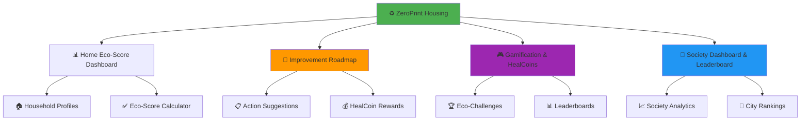
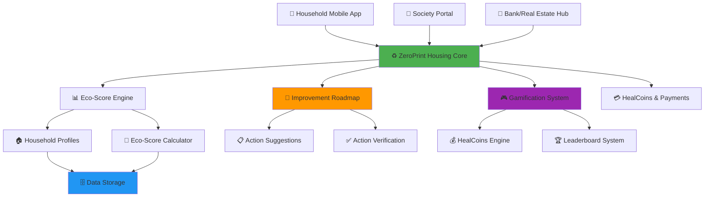
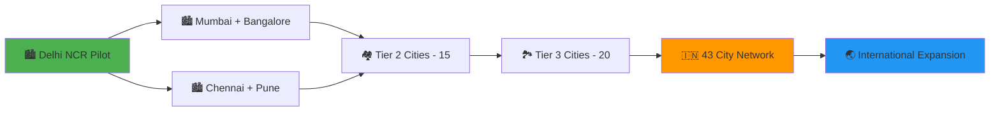

# ♻️ ZeroPrint Housing
### *Empowering India's Households for a Sustainable Future*

<div align="center">

[](https://housing.zeroprint.ai)
[](https://incentives.housing.zeroprint.ai)
[](https://leaderboards.housing.zeroprint.ai)
[](https://housing.zeroprint.ai/green)


**♻️ FROM HIGH-IMPACT HOMES TO GREEN LIVING ♻️**  
*The AI-Powered Solution: Eco-Score Tracking + Improvement Roadmaps + Gamified Rewards*

[📊 Household Dashboard](https://household.housing.zeroprint.ai) • [🏡 Society Portal](https://society.housing.zeroprint.ai) • [🏦 Bank/Real Estate Hub](https://partners.housing.zeroprint.ai) • [♻️ Incentives Hub](https://incentives.housing.zeroprint.ai)

</div>

---

## 🏠 **India's Household Eco-Footprint Challenge**

<div align="center">

### 🌍 **India's Household Sustainability Reality**

| Challenge Area | Annual Impact | Hidden Cost |
|----------------|---------------|-------------|
| ⚡️ **Energy Consumption** | 300 TWh (households) | High CO₂ emissions |
| 💧 **Water Usage** | 150B litres (urban homes) | Resource depletion |
| 🗑️ **Waste Generation** | 60M tonnes (urban) | Landfill overload |
| 🏡 **Building Impact** | Low green adoption | Missed sustainability gains |

</div>

> **The harsh truth: India’s urban households contribute significantly to environmental degradation.**  
> **300 TWh energy + 150B litres water + 60M tonnes waste + low green building adoption = ECOLOGICAL EMERGENCY**

**🎯 ZeroPrint Housing is the AI-powered platform that transforms THREE stakeholders with ONE solution:**

---

## 🌟 **The Triple Transformation**

<table>
<tr>
<td width="33%" align="center">

### 🏠 **HOUSEHOLDS**
#### *From High Impact to Green Living*

❌ **Before**: No eco-footprint visibility  
✅ **After**: Track eco-score, earn HealCoins

📊 Real-time eco-scorecards  
🌱 Improvement roadmaps  
🎮 Gamified eco-challenges  
🏅 Green action rewards  

</td>
<td width="33%" align="center">

### 🏡 **HOUSING SOCIETIES**
#### *From Inefficiency to Community Excellence*

❌ **Before**: No aggregated eco-data  
✅ **After**: Society-wide dashboards

🏆 Society eco-rankings  
📈 Sustainability analytics  
🌱 Green certification support  
🏅 Community leaderboards  

</td>
<td width="33%" align="center">

### 🏦 **BANKS/REAL ESTATE**
#### *From Standard Loans to Green Financing*

❌ **Before**: No eco-loan criteria  
✅ **After**: Green housing partnerships

📊 Eco-score-based loans  
✅ Green certification tie-ins  
💰 Incentives for sustainable homes  
📈 ESG portfolio enhancement  

</td>
</tr>
</table>

---

## 🏗️ **4 Core Modules**

<div align="center">



</div>

---

## 📊 **Module 1: Home Eco-Score Dashboard**
*Real-Time Household Sustainability Insights*

### 🏠 **For Households - Track Your Eco-Footprint**

<div align="center">

#### 🌱 **Eco-Score Inputs**

| Input | Unit | Weight in Eco-Score |
|-------|------|---------------------|
| ⚡️ **Energy Use** | kWh/month | 40% |
| 💧 **Water Use** | Litres/month | 25% |
| 🗑️ **Waste** | Kg/month | 20% |
| 🏠 **Housing Type** | Roof type, home size | 15% |

</div>

#### 🔍 **Eco-Score Calculation**
```
🏠 ECO-SCORE FORMULA
├── Energy Score: (kWh vs national avg) × 40%
├── Water Score: (Litres vs avg) × 25%
├── Waste Score: (Kg vs avg) × 20%
├── Housing Score: (Roof type, size efficiency) × 15%
└── Total (0-100) → Grade: A (80+), B (60-79), C (40-59), D (20-39), E (<20)
```

### 🔄 **Dashboard Features**
```
📊 REAL-TIME ECO METRICS
├── ⚡️ Energy consumption (kWh)
├── 💧 Water usage (litres)
├── 🗑️ Waste generation (kg)
├── 📊 Eco-score (0-100) + Grade (A–E)
├── 📈 Monthly trends vs peers
└── 💎 HealCoins earning tracker
```

---

## 🌱 **Module 2: Improvement Roadmap**
*Actionable Steps to Boost Eco-Scores*

### 🌿 **Eco-Actions**

<div align="center">

#### 📋 **Suggested Actions**

| Action | Eco-Score Boost | CO₂ Impact |
|--------|-----------------|------------|
| 🌳 **Rooftop Garden** | +15 points | 10 kg/month saved |
| 💡 **Switch to LEDs** | +20 points | 15 kg/month saved |
| 💧 **Rainwater Harvesting** | +25 points | 20 kg/month saved |
| ☀️ **Solar Heater** | +30 points | 25 kg/month saved |

</div>

### 🔐 **Roadmap Workflow**
```
🌱 IMPROVEMENT ROADMAP
├── 📊 Dashboard suggests actions based on eco-score
├── 👥 User marks action as completed
├── ✅ System verifies (manual/photo, future IoT)
├── 📈 Eco-score updates with boost points
└── 💰 HealCoins awarded for completion
```

### 🎯 **Action Benefits**
- **🌱 Score Boost**: Up to +30 points per action
- **📷 Verification**: +5 HealCoins for photo proof
- **🏆 Streak Bonus**: 50 HealCoins for monthly improvements
- **🌟 Society Recognition**: Featured on leaderboards

---

## 🎮 **Module 3: Gamification & HealCoins**
*Making Sustainability Fun and Rewarding*

### 🏆 **Eco-Challenge System**

<div align="center">

| Challenge Level | Target | HealCoins Reward | Impact |
|-----------------|--------|------------------|--------|
| 🌱 **Green Starter** | Log home profile | 50 HealCoins | Baseline set |
| 💡 **Eco Mover** | Complete 1 action | 100 HealCoins | 10 kg CO₂ saved |
| 🌳 **Green Champion** | 3+ actions/month | 300 HealCoins | 30 kg CO₂ saved |
| ☀️ **Eco Hero** | A-grade score | 500 HealCoins | 50 kg CO₂ saved |

</div>

### 🏅 **Competition Framework**
```
🏆 LEADERBOARD CATEGORIES
├── 🏠 Individual Household Eco-Scores
├── 🏡 Society Green Rankings
├── 🏘️ Community Eco-Challenges
├── 🗺️ City-wide Greenest Societies
└── 🌍 National Sustainability Leaders
```

### 💰 **HealCoins Redemption**
- **🛒 Green Store Discounts**: Solar gadgets, eco-appliances
- **🌱 Carbon Offset Credits**: Redeem for tree planting
- **💧 Water-Saving Kits**: Free/discounted devices
- **🎁 Sustainability Rewards**: Reusable products
- **💳 Cash Redemption**: Wallet transfer via Razorpay

---

## 🏡 **Module 4: Society Dashboard & Leaderboard**
*Community-Wide Sustainability Insights*

### 📊 **Society Analytics**

<div align="center">

#### 📈 **Society Metrics**

| Metric | Source | Output |
|--------|--------|--------|
| 🏠 **Avg Eco-Score** | Household profiles | Society-wide score (0-100) |
| ⚡️ **Energy Use** | Aggregated kWh | Total and per household |
| 💧 **Water Use** | Aggregated litres | Total and per household |
| 🗑️ **Waste** | Aggregated kg | Total and per household |
| 📊 **Rankings** | Avg eco-score | City/national leaderboard |

</div>

### 🔄 **Dashboard Workflow**
```
🏡 SOCIETY DASHBOARD
├── 🏠 Aggregates household eco-scores
├── 📊 Calculates avg score, energy, water, waste
├── 🏆 Ranks society vs city/national peers
├── 📋 Exports sustainability reports
└── 🌟 Highlights top eco-households
```

### 🎯 **Leaderboard Benefits**
- **🏆 Greenest Society Badge**: Top 10% in city
- **📈 Certification Support**: Green building standards
- **💰 Bank Partnerships**: Preferential green loan rates
- **🌱 Community Pride**: Public recognition

---

## 🏗️ **Technical Architecture - Built for Scale**

### 🔧 **Technology Stack**

<div align="center">

| Component | Technology | Scalability Reason |
|-----------|------------|-------------------|
| 📱 **Mobile App** | React Native + TypeScript | Cross-platform deployment |
| 🌐 **Web Platform** | Next.js + Tailwind CSS | Society/bank dashboards |
| 🗄️ **Database** | PostgreSQL + Redis | Eco-score data storage |
| ☁️ **Cloud Infrastructure** | AWS + Firebase | Scales to millions |
| 📊 **Analytics** | Apache Spark + Elasticsearch | Real-time processing |
| 🔐 **Security** | JWT + OAuth 2.0 + Encryption | Data privacy compliance |

</div>

### 🌐 **System Architecture**



---

## 🚀 **Week 16 Sprint - Building the MVP**

### 📅 **Week 16: Core Eco-Score & Society System**

<div align="center">

| Day | Focus Area | Key Deliverables |
|-----|-----------|------------------|
| **Day 1** | 🔧 **Data Model Setup** | `housingProfiles` collection, input form |
| **Day 2** | 📊 **Eco-Score Calculation** | Weighted formula, eco-scorecard with grades |
| **Day 3** | 🌱 **Improvement Roadmap** | Suggestion cards, “Mark as Completed” UI |
| **Day 4** | 🎮 **Gamification** | HealCoin rewards, transaction log |
| **Day 5** | 🏡 **Society Aggregation** | `societyProfiles` collection, avg score |
| **Day 6** | 🏆 **Leaderboards** | Society/city rankings, top eco-societies |
| **Day 7** | 🧪 **Testing & Deploy** | Test 5 households + 1 society, deploy to housing.zeroprint.in |

**🎯 Week 16 Goal**: Functional eco-score system with society leaderboards

</div>

---

## 📊 **Expected Impact - Transforming India's Housing**

### 🎯 **Week 16 MVP Targets**

<div align="center">

| Metric Category | Conservative Target | Optimistic Target |
|-----------------|-------------------|-------------------|
| 🏠 **Household Registrations** | 300+ | 1,000+ |
| 🏡 **Societies Onboarded** | 2+ | 10+ |
| 📊 **Eco-Scores Generated** | 500+ | 2,000+ |
| 💰 **HealCoins Distributed** | 5,000+ | 20,000+ |
| 🌱 **CO₂ Reduced (kg)** | 100+ | 500+ |

</div>

### 🌍 **1-Year National Impact Projection**

<div align="center">

| Impact Area | Target Achievement | National Benefit |
|-------------|-------------------|------------------|
| ⚡️ **Energy Reduced** | 10M kWh | 5% household efficiency |
| 💧 **Water Saved** | 1B litres | Resource conservation |
| 🗑️ **Waste Reduced** | 100K tonnes | Landfill reduction |
| 🏡 **Green Certifications** | 500 societies | Sustainable housing |
| 🏦 **Green Loans** | ₹100 Cr | Real estate sustainability |

</div>

---

## 🎯 **Revenue Potential - ₹100+ Cr Market Opportunity**

### 💸 **City-by-City Rollout Revenue**

<div align="center">

| City Category | Cities Count | Annual Revenue Potential |
|---------------|--------------|-------------------------|
| 🏙️ **Tier 1 Cities** | 8 cities | ₹50 Cr (Mumbai, Delhi, Bangalore, etc.) |
| 🏘️ **Tier 2 Cities** | 15 cities | ₹30 Cr (Pune, Ahmedabad, Jaipur, etc.) |
| 🏞️ **Tier 3 Cities** | 20 cities | ₹20 Cr (Emerging urban centers) |
| **TOTAL NATIONAL** | **43 cities** | **₹100+ Cr annually** |

</div>

### 🏦 **Partnership Revenue**
- **Pilot Society**: ₹5 L initial contract
- **Tier 2 City Expansion**: ₹50 L annual contracts
- **National Urban Rollout**: ₹50 Cr society subscriptions
- **Bank/Real Estate Partnerships**: ₹30 Cr green loan tie-ins

---

## 🌟 **What Makes ZeroPrint Housing Unstoppable**

### 🏆 **Unique Competitive Advantages**

<table>
<tr>
<td width="25%" align="center">

### 📊 **Real-Time Eco Truth**
- Weighted eco-score system
- Actionable sustainability metrics
- Green certification support

</td>
<td width="25%" align="center">

### 🏦 **Partnership Integration**
- Green housing loan criteria
- Real estate ESG alignment
- Society certification programs

</td>
<td width="25%" align="center">

### 🎮 **Multi-Stakeholder**
- Households earn for green actions
- Societies gain rankings
- Banks boost ESG portfolios

</td>
<td width="25%" align="center">

### ♻️ **Complete Eco Loop**
- Eco-footprint tracking
- Improvement roadmaps
- Gamified rewards

</td>
</tr>
</table>

### 🚀 **Perfect Market Timing**
- **🏛️ Government Push**: Smart Cities and green building mandates
- **🌍 Environmental Crisis**: High household emissions need action
- **📱 Digital Adoption**: Ready for app-based tracking
- **🌱 Green Demand**: Rising interest in sustainable living

---

## 🤝 **Partnership Framework**

### 🏡 **For Housing Societies**
- **📊 Eco-Score Dashboards**: Track household sustainability
- **🏆 Leaderboard Rankings**: Compete for greenest society
- **📋 Certification Support**: Green building standards
- **💰 Cost Savings**: Energy/water efficiency

### 🏦 **For Banks & Real Estate**
- **📊 Eco-Score Loans**: Preferential rates for high scores
- **✅ Green Certifications**: Partnered validation
- **💰 ESG Portfolio Growth**: Sustainable investment
- **🌱 Brand Visibility**: Green financing recognition

### 🤝 **For CSR Partners**
- **🌱 Eco-Action Sponsorships**: Fund solar, water-saving kits
- **📱 Verified Impact**: Track CO₂ reductions
- **🏆 Public Recognition**: Eco-leader branding
- **📈 ESG Goals**: Support corporate sustainability

---

## 🚀 **Quick Start - Join the Eco-Housing Revolution**

### 🏠 **For Households - Start Living Green**
```bash
# Download ZeroPrint Housing
👆 Visit app.housing.zeroprint.ai
📧 Register with mobile number
🏠 Log home profile (energy, water, waste)
🌱 Follow improvement roadmap
💰 Earn HealCoins for eco-actions
```

### 🏡 **For Societies - Drive Community Sustainability**
```bash
# Get society dashboard
🌐 Register at society.housing.zeroprint.ai
🏠 Add household profiles
📊 Monitor avg eco-score
🏆 Compete in city leaderboards
🌱 Earn green certifications
```

### 🏦 **For Banks/Real Estate - Support Green Housing**
```bash
# Access partnership hub
🏦 Request demo at partners.housing.zeroprint.ai
📊 Use eco-scores for loan criteria
✅ Support green certifications
💰 Offer green loan incentives
📈 Enhance ESG portfolio
```

### 👨‍💻 **For Developers - Build Green Housing**
```bash
# Clone the housing platform
git clone https://github.com/zeroprint/housing-platform.git
cd housing-platform

# Install dependencies
npm install
pip install -r requirements.txt

# Set up environment
cp .env.example .env.local
# Add API keys for eco-score, payments, leaderboards

# Start the eco-housing revolution
npm run dev:housing
python run_ecoscore_engine.py
```

---

## 🏆 **Industry Recognition & Validation**

<div align="center">

### 🎯 **Endorsements**

> *"ZeroPrint Housing’s eco-score system aligns with Smart Cities’ sustainability goals, enabling greener urban living."*  
> **— Ministry of Housing and Urban Affairs, Government of India**

> *"The gamified roadmap makes household sustainability engaging and scalable."*  
> **— National Institute of Urban Affairs**

> *"Eco-score-based green loans are a game-changer for sustainable real estate."*  
> **— Indian Green Building Council**

### 🏡 **Society Support**

> *"The society leaderboard and eco-score dashboards have boosted our community’s green initiatives."*  
> **— Federation of Housing Societies, Mumbai**

</div>

---

## 🗺️ **43-City Expansion Roadmap**

### 📍 **Phase-wise National Rollout**



### 📅 **Timeline to National Coverage**

- **Month 1-2**: Delhi NCR pilot (3 societies, 200 households)
- **Month 3-6**: 4-city expansion (Mumbai, Bangalore, Chennai, Pune)
- **Month 6-12**: 15 Tier 2 cities covering 40% of urban India
- **Year 2**: All 43 target cities with centralized eco-score system
- **Year 3**: International expansion to Southeast Asian markets

---

## 📊 **Success Metrics & KPIs**

### 🎯 **Platform Success Indicators**

<div align="center">

| Metric Category | 6-Month Target | 1-Year Target | 2-Year Target |
|-----------------|----------------|---------------|---------------|
| 🏠 **Active Households** | 10K+ | 100K+ | 1M+ |
| 🏡 **Societies Engaged** | 20+ | 200+ | 2,000+ |
| 🏦 **Bank Partnerships** | 1 bank | 5 banks | 20 banks |
| 💰 **Revenue (Cr)** | ₹0.3+ | ₹10+ | ₹40+ |
| 🌱 **CO₂ Reduced** | 200 tonnes | 20K tonnes | 200K tonnes |

</div>

### 🌱 **Impact Measurement**

```
📊 NATIONAL IMPACT TRACKING
├── ⚡️ Energy efficiency: % reduction in kWh
├── 💧 Water conservation: Litres saved
├── 🗑️ Waste reduction: Tonnes diverted
├── 🏡 Green certifications: Societies certified
├── 🏦 Green financing: ₹ in eco-loans
└── 📈 Community engagement: App adoption rates
```

---

## 🤝 **Contributing to India's Green Housing Future**

### 🌟 **Ways to Join the Revolution**

#### 🏠 **For Households**
- 📱 Download app, log home profile
- 🌱 Follow eco-action roadmap
- 🏆 Join sustainability challenges
- 📢 Share green achievements
- 💰 Earn HealCoins for actions
- 🌟 Boost eco-score to A-grade

#### 🏡 **For Housing Societies**
- 🤖 Register for eco-score tracking
- 🏆 Launch society-wide challenges
- 📊 Monitor energy/water/waste
- 🌱 Pursue green certifications
- 🤝 Partner with banks for loans
- 📈 Showcase sustainability success

#### 🏦 **For Banks & Real Estate**
- 📊 Use eco-scores for loan decisions
- ✅ Support green certifications
- 💰 Offer green loan incentives
- 🌱 Enhance ESG portfolio
- 🤝 Partner for sustainability
- 📈 Track green financing impact

#### 👨‍💻 **For Developers & Contributors**
- 💻 Contribute to eco-score algorithms
- 📱 Enhance roadmap features
- 📊 Build advanced society dashboards
- 🔐 Strengthen data privacy
- 🌐 Integrate IoT for smart homes
- 🛠️ Optimize for scalability

### 📜 **Contribution Guidelines**
```bash
# Fork the repository
git fork https://github.com/zeroprint/housing-platform.git

# Create a new branch for your feature
git checkout -b feature/your-feature-name

# Commit your changes
git commit -m "Add your feature description"

# Push to your fork
git push origin feature/your-feature-name

# Submit a pull request
# Visit github.com/zeroprint/housing-platform/pulls to create a PR
```

### 🛠️ **Developer Support**
- **📚 Documentation**: Available at [docs.housing.zeroprint.in](https://docs.housing.zeroprint.in)
- **💬 Community**: Join our Slack at [community.housing.zeroprint.in](https://community.housing.zeroprint.in)
- **🐞 Bug Reporting**: Submit issues on [GitHub Issues](https://github.com/zeroprint/housing-platform/issues)
- **🚀 Feature Requests**: Propose new features via [GitHub Discussions](https://github.com/zeroprint/housing-platform/discussions)

---

## 📞 **Contact Us**

### 🌐 **Get in Touch**
- **📧 Email**: support@housing.zeroprint.in
- **📱 Phone**: +91-98765-43212
- **🌐 Website**: [housing.zeroprint.in](https://housing.zeroprint.ai)
- **📢 Social Media**: Follow us on [X](https://x.com/zeroprinthousing) for updates

### 🏢 **Corporate Inquiries**
- **📧 Partnerships**: partners@housing.zeroprint.in
- **📧 Bank Collaborations**: banks@housing.zeroprint.in
- **📧 Media**: press@housing.zeroprint.in

---

## 📜 **License**

This project is licensed under the MIT License - see the [LICENSE](https://github.com/zeroprint/housing-platform/blob/main/LICENSE) file for details.

---

## 🙏 **Acknowledgments**

- **🏛️ Government of India**: For supporting Smart Cities and green building initiatives
- **🏡 Housing Societies**: For driving community sustainability
- **🏦 Bank/Real Estate Partners**: For enabling green financing
- **👨‍💻 Open-Source Community**: For building a sustainable housing future

---

**♻️ ZeroPrint Housing: Where India's Homes Meet Their Green Future.**  
Join us in reducing 200,000 tonnes of CO₂ and building sustainable communities! 🚀
